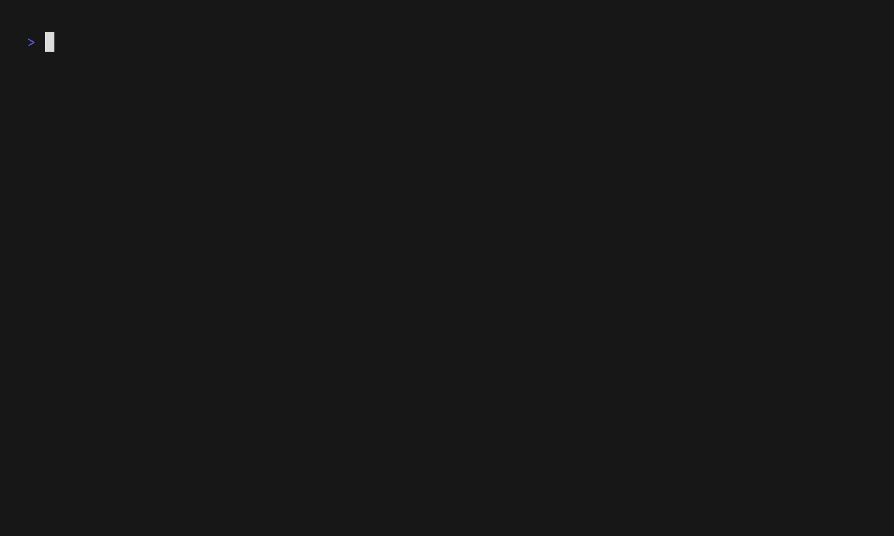

# ferriby

Keep Ferrises alive and happy by feeding them commits in your repositories.  
They can live in a local, a GitHub or a Codeberg repository.



## Usage

```shell
ferriby -gh owner/repository
```

```shell
ferriby -g path_to_local_repository
```

```shell
ferriby -cb owner/repository
```

You can use ferriby with multiple repositories at once:

```shell
ferriby -g local_path -gh owner/repo -g other_path -gh ...
```

Use a custom config file path:

```shell
ferriby -c config_file.json
```

## Installation

You can install ferriby from [crates.io](https://crates.io/crates/ferriby):

```shell
cargo install ferriby
```

On Arch Linux, you can install it from the [AUR](https://aur.archlinux.org/packages/ferriby):

```shell
paru -S ferriby
```

## Configuration

To access private GitHub repos and to have a higher rate limit for the checks,
you can pass a PAT (Personal Access Token) to ferriby via the environment variable `FERRIBY_GH_PAT`.  
Create your PAT in the [settings section](https://github.com/settings/personal-access-tokens) with `Repository permissions` of `Read`.
Test it with

```shell
FERRIBY_GH_PAT="xyz" ferriby -gh owner/repository
```

It is strongly recommended to do this. Otherwise you are rate limited to 60 checks per hour.


ferriby looks for a config file in `$HOME/.config/ferriby/config.json` (`$HOME/AppData/Roaming/ferriby/config.json` on Windows).
You can override that path with the `-c` argument.
The config file should look like this:

```json
{
  "git": [
    "/home/dawe/src/ferriby",
    "/home/dawe/src/tusistor"
  ],
  "github": [
    "dawedawe/ratatui",
    "dawedawe/ratzilla"
  ],
  "codeberg": [
    "dawe/ferriby"
  ]
}
```

At least one repository needs to be configured. The json needs to be clean, no trailing commas allowed.

## Advisory

This is gamification. If you have a human to love or a dog to walk, do that!

## Credits

The ASCII art is based on work by [Diggory Blake](https://github.com/diggsey). Thanks!

This is a [Ratatui] app generated by the [event driven async template].

[Ratatui]: https://ratatui.rs
[event driven async template]: https://github.com/ratatui/templates/tree/main/event-driven-async

## License

Copyright (c) dawe <dawedawe@posteo.de>

This project is licensed under the MIT license ([LICENSE] or <http://opensource.org/licenses/MIT>)

[LICENSE]: ./LICENSE
